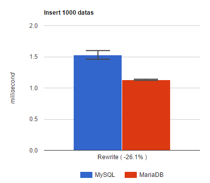

# JMH performance MariaDB/MySQL driver test

We always talk about performance, but the thing is always "Measure, don’t guess!".
This is a benchmark of [MariaDB java connector](https://github.com/MariaDB/mariadb-connector-j) versus [MySQL java connector](https://github.com/mysql/mysql-connector-j).
MariaDB and MySQL databases are using the same exchange protocol, and driver offer similar functionalities. 

This is a Driver benchmark using [JMH microbenchmark](http://openjdk.java.net/projects/code-tools/jmh/)
developed by the same guys in Oracle who implement the JIT, and is delivered as openJDK tools.

## The tests
Class BenchmarkInit initialize connections using MySQL and MariaDB drivers before tests.

test example org.perf.jdbc.BenchmarkPrepareStatementOneInsert : 
```java
public class BenchmarkPrepareStatementOneInsert extends BenchmarkInit {
    private String request = "INSERT INTO PerfTextQuery (charValue) values (?)";

    @Benchmark
    public boolean mysql(MyState state) throws Throwable {
        return executeOneInsertPrepare(state.mysqlConnection, state.insertData);
    }

    @Benchmark
    public boolean mariadb(MyState state) throws Throwable {
        return executeOneInsertPrepare(state.mariadbConnection, state.insertData);
    }

    private boolean executeOneInsertPrepare(Connection connection, String[] datas) throws SQLException {
        PreparedStatement preparedStatement = connection.prepareStatement(request);
        preparedStatement.setString(1, datas[0]);
        boolean hasResultSet = preparedStatement.execute();
        preparedStatement.close();
        return hasResultSet;
    }

}
```

The test will execute the prepareStatement "INSERT INTO PerfTextQuery (charValue) values (?)" using a connection issued from MySQL or MariaDB driver.

Tests are launched multiple times using 10 forks , 20 warmup iterations of one second followed by 20 measurement iterations of one second.


List of tests and their signification :

|Benchmark       |description |
|-----------|:----------|
| BenchmarkOneInsert* | execute query "INSERT INTO PerfTextQuery (charValue) values ('abc')"|
| BenchmarkOneInsertFailover*|same as BenchmarkOneInsert but using failover configuration|
| BenchmarkPrepareStatementOneInsert*|same as BenchmarkOneInsert but using "prepare" |
| BenchmarkPrepareStatementOneInsertFailover*|same as BenchmarkOneInsert but using "prepare" and failover configuration |
| BenchmarkSelect1Row|execute query "SELECT * FROM PerfReadQuery where id = 0";|
| BenchmarkSelect1RowFailover|same than BenchmarkSelect1Row but using failover configuration|
| BenchmarkSelect1000Rows|execute query "SELECT * FROM PerfReadQuery" (table with 1000 rows, each rows contain < 10 bytes) )|
| BenchmarkSelect1000BigRows|execute query "SELECT * FROM PerfReadQueryBig" (table with 1000 rows, each rows contain 10kb)|
| BenchmarkBatch1000InsertWithPrepare*|executing 1000 inserts using prepareStatement with "prepare" on server. (option useServerPrepStmts=true)|
| BenchmarkBatch1000InsertWithoutPrepare*|executing 1000 inserts. (option useServerPrepStmts=false)|
| BenchmarkBatch1000InsertRewrite*|executing 1000 inserts. (option rewriteBatchedStatements=true)|
| BenchmarkCallableStatementFunction|execute CallableStatement with query "{? = CALL testFunctionCall(?,?,?)}". Function created by "CREATE FUNCTION IF NOT EXISTS testFunctionCall(a float, b bigint, c int) RETURNS INT NO SQL \nBEGIN \nRETURN a; \nEND"|
| BenchmarkCallableStatementWithInParameter|execute CallableStatement with query "{call withResultSet(?)}". Procedure created with "CREATE PROCEDURE IF NOT EXISTS withResultSet(a int) begin select a; end"|
| BenchmarkCallableStatementWithOutParameter|execute CallableStatement with query "{call inOutParam(?)}". Procedure created with "CREATE PROCEDURE IF NOT EXISTS inoutParam(INOUT p1 INT) begin set p1 = p1 + 1; end"|

'* The goal is here to test the driver performance, not database, so INSERT's queries are send to a [BLACKHOLE](https://mariadb.com/kb/en/mariadb/blackhole/) engine (data are not stored). This permit to have more stable results.


## How run the tests
* install a MySQL / MariaDB database with user root without password
* create database "testj"
* create user perf : GRANT ALL ON testj.* TO 'perf'@'localhost' IDENTIFIED BY '!Password0';
* install engine [BLACKHOLE](https://mariadb.com/kb/en/mariadb/blackhole/) using command "INSTALL SONAME 'ha_blackhole'" (This engine don't save data, permitting to execute INSERT queries with stable time result)
* restart database to activate the BLACKHOLE engine
* install a JRE
* install maven
* install git

```script
git clone https://github.com/rusher/mariadb-mysql-driver.git
mvn clean install
java -Xmx64m -Xms64m -Duser.country=US -Duser.language=en -jar target/benchmarks.jar > result.txt &
```
-Duser.country=US -Duser.language=en permit to avoid confusion with comma used as decimal separator / thousand separator according to countries
-Xmx64m -Xms64m is to permit to have quick garbage and have more stable results. 

## Read results 

Execution on a droplet on digitalocean.com using this parameters:
- CentOS 7.2 64bits
- 1GB memory
- 1 CPU
using default mariadb 10.1 configuration file

Results are in file "result.txt".
Complete results are the end of the file. Example of results : 


```

# Run complete. Total time: 02:04:50

Benchmark                                           Mode  Cnt      Score      Error  Units
BenchmarkBatch1000InsertRewrite.mariadb             avgt  200      1.794 ±    0.079  ms/op
BenchmarkBatch1000InsertRewrite.mysql               avgt  200      2.029 ±    0.072  ms/op
BenchmarkBatch1000InsertWithPrepare.mariadb         avgt  200     64.626 ±    2.616  ms/op
BenchmarkBatch1000InsertWithPrepare.mysql           avgt  200     77.398 ±    3.825  ms/op
BenchmarkBatch1000InsertWithoutPrepare.drizzle      avgt  200    112.428 ±    2.681  ms/op
BenchmarkBatch1000InsertWithoutPrepare.mariadb      avgt  200     91.085 ±    2.967  ms/op
BenchmarkBatch1000InsertWithoutPrepare.mysql        avgt  200     97.374 ±    2.378  ms/op
BenchmarkCallableStatementFunction.mariadb          avgt  200    140.729 ±    3.955  us/op
BenchmarkCallableStatementFunction.mysql            avgt  200   2225.743 ±   67.761  us/op
BenchmarkCallableStatementWithInParameter.mariadb   avgt  200     97.583 ±    2.189  us/op
BenchmarkCallableStatementWithInParameter.mysql     avgt  200   2180.432 ±   80.557  us/op
BenchmarkCallableStatementWithOutParameter.mariadb  avgt  200     90.299 ±    2.377  us/op
BenchmarkCallableStatementWithOutParameter.mysql    avgt  200   2352.639 ±   84.619  us/op
BenchmarkOneInsert.drizzle                          avgt  200    113.340 ±    3.484  us/op
BenchmarkOneInsert.mariadb                          avgt  200     86.628 ±    2.354  us/op
BenchmarkOneInsert.mysql                            avgt  200    202.543 ±    4.855  us/op
BenchmarkOneInsertFailover.mariadb                  avgt  200     91.966 ±    2.469  us/op
BenchmarkOneInsertFailover.mysql                    avgt  200    116.520 ±    2.324  us/op
BenchmarkPrepareStatementOneInsert.mariadb          avgt  200     72.621 ±    3.407  us/op
BenchmarkPrepareStatementOneInsert.mysql            avgt  200    187.943 ±    4.530  us/op
BenchmarkPrepareStatementOneInsertFailover.mariadb  avgt  200     70.871 ±    2.264  us/op
BenchmarkPrepareStatementOneInsertFailover.mysql    avgt  200     98.273 ±    3.349  us/op
BenchmarkSelect1000BigRows.drizzle                  avgt  200  65585.084 ± 1703.481  us/op
BenchmarkSelect1000BigRows.mariadb                  avgt  200  58574.563 ± 1662.803  us/op
BenchmarkSelect1000BigRows.mysql                    avgt  200  62706.456 ± 1243.911  us/op
BenchmarkSelect1000Rows.drizzle                     avgt  200   1522.172 ±   32.293  us/op
BenchmarkSelect1000Rows.mariadb                     avgt  200   1227.215 ±   31.009  us/op
BenchmarkSelect1000Rows.mysql                       avgt  200   1297.720 ±   45.662  us/op
BenchmarkSelect1Row.drizzle                         avgt  200    724.186 ±   26.431  us/op
BenchmarkSelect1Row.mariadb                         avgt  200    663.133 ±   18.063  us/op
BenchmarkSelect1Row.mysql                           avgt  200    681.805 ±   17.590  us/op
BenchmarkSelect1RowFailover.mariadb                 avgt  200    672.965 ±   18.827  us/op
BenchmarkSelect1RowFailover.mysql                   avgt  200    696.748 ±   21.919  us/op


```

##### How to read it :

ms/op means millisecond per operation, us/op microsecond per operation.

```
BenchmarkBatch1000InsertRewrite.mariadb             avgt  200      1.794 ±    0.079  ms/op
BenchmarkBatch1000InsertRewrite.mysql               avgt  200      2.029 ±    0.072  ms/op
```


<div style="text-align:center"></div>

BenchmarkBatch1000InsertRewrite = executing 1000 inserts with option rewriteBatchedStatements=true.
Using mariadb driver, it take 1.794 millisecond to insert those 1000 data, and 99.9% of queries executes time are comprised between 1.715 (1.794 - 0.079) and 1.873 milliseconds (1.794 + 0.072).
Using MySQL java driver, execution time is 2.029 millisecond.   
(remember that INSERT queries are executed on BLACKHOLE engine, those number just reflect the execution time of the driver + exchanges with database).

##### Other example : 

```
BenchmarkBatch1000InsertWithPrepare.mariadb         avgt  200     64.626 ±    2.616  ms/op
BenchmarkBatch1000InsertWithPrepare.mysql           avgt  200     77.398 ±    3.825  ms/op
BenchmarkBatch1000InsertWithoutPrepare.drizzle      avgt  200    112.428 ±    2.681  ms/op
BenchmarkBatch1000InsertWithoutPrepare.mariadb      avgt  200     91.085 ±    2.967  ms/op
```

<div style="text-align:center"></div>


